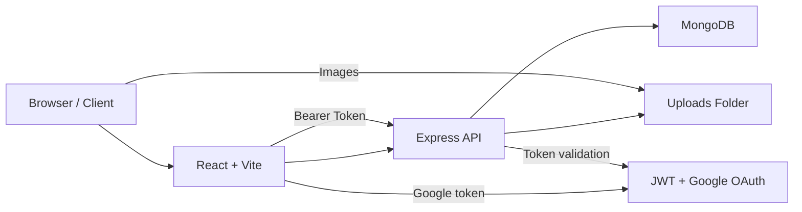
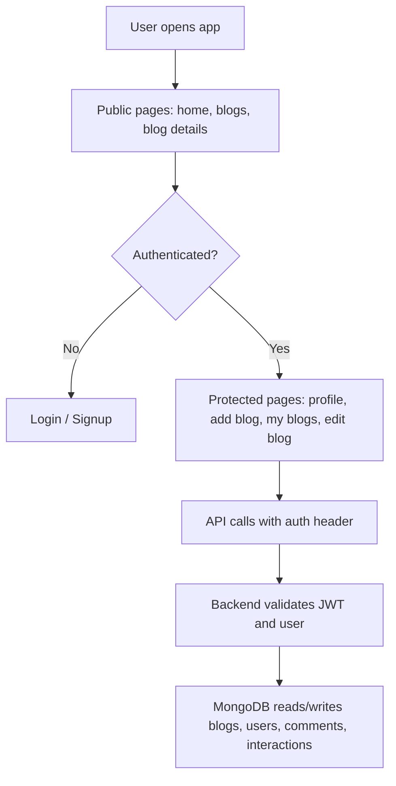

# Bite & Roam - Blog Application

> A modern full-stack blog platform for sharing travel, food, and lifestyle stories with a polished UI and expressive content features.


---

## 📋 Table of Contents

- [Bite \& Roam - Blog Application](#bite--roam---blog-application)
  - [📋 Table of Contents](#-table-of-contents)
  - [🎯 Overview](#-overview)
  - [✨ Features](#-features)
  - [🛠️ Tech Stack](#️-tech-stack)
    - [Frontend](#frontend)
    - [Backend](#backend)
  - [🧠 Architecture](#-architecture)
    - [Application flow](#application-flow)
    - [User journey](#user-journey)
  - [📁 Project Structure](#-project-structure)
  - [🚀 Prerequisites](#-prerequisites)
  - [⚙️ Installation](#️-installation)
    - [Backend](#backend-1)
    - [Frontend](#frontend-1)
  - [🔧 Configuration](#-configuration)
  - [▶️ Running the Application](#️-running-the-application)
    - [Start backend](#start-backend)
    - [Start frontend](#start-frontend)
    - [Local URLs](#local-urls)
  - [🔌 API Endpoints](#-api-endpoints)
    - [User endpoints](#user-endpoints)
    - [Blog endpoints](#blog-endpoints)
  - [📷 Screenshot](#-screenshot)
  - [🛠️ Troubleshooting](#️-troubleshooting)
  - [🤝 Contributing](#-contributing)
  - [📜 License](#-license)

---

## 🎯 Overview

Bite & Roam is a full-stack blog application built with React, Tailwind CSS, Express, and MongoDB. The app supports account creation, Google sign-in, blog publishing, editing, commenting, likes, bookmarks, and responsive browsing across devices.

---

## ✨ Features

- ✅ JWT authentication with protected routes
- ✅ Google OAuth sign-in
- ✅ Blog CRUD with image uploads
- ✅ Search, filters, and pagination for blog browsing
- ✅ Blog details with comments, likes, and bookmarks
- ✅ Profile editing and password management
- ✅ Secure backend with helmet, rate limiting, validation, and sanitization
- ✅ Modern responsive UI with reusable components

---

## 🛠️ Tech Stack

### Frontend

- React 18
- Vite
- Redux Toolkit
- Tailwind CSS
- Material UI
- React Router v6
- Axios
- React Quill
- Sonner
- Google OAuth

### Backend

- Node.js
- Express.js
- MongoDB
- Mongoose
- JWT
- Bcrypt
- Multer
- Helmet
- express-rate-limit
- express-validator
- sanitize-html

---

## 🧠 Architecture

### Application flow



### User journey



---

## 📁 Project Structure

- `backend/`
  - `config/` - DB connection, auth config, Google OAuth, token helpers
  - `controllers/` - user and blog request handlers
  - `middleware/` - auth, validation, upload, error handling, rate limiting
  - `models/` - Mongoose schemas for `Blog`, `User`, `Comment`, `Like`, `Bookmark`
  - `routes/` - `/api/user` and `/api/blog` endpoints
  - `uploads/` - image storage for blog posts
- `frontend1/`
  - `src/api.js` - Axios client with auth interceptor
  - `src/lib/endpoints.js` - API base URL constants
  - `src/components/` - pages, features, layout, and reusable UI blocks
  - `src/hooks/` - custom hooks for blog API logic and auth state
  - `src/store/` - Redux store and auth state management
  - `src/utils/` - validation, sanitization, toast helpers

---

## 🚀 Prerequisites

- Node.js 18+
- npm 10+
- MongoDB (local or Atlas)

---

## ⚙️ Installation

### Backend

```bash
cd backend
npm install
```

### Frontend

```bash
cd frontend1
npm install
```

---

## 🔧 Configuration

Create a `.env` file in `backend/` with:

```env
MONGO_URI=your_mongodb_connection_string
JWT_SECRET=your_jwt_secret
REFRESH_SECRET=your_refresh_secret
GOOGLE_CLIENT_ID=your_google_client_id
ALLOWED_ORIGINS=http://localhost:5173,http://localhost:3000,http://localhost:5001
PORT=8000
NODE_ENV=development
```

---

## ▶️ Running the Application

### Start backend

```bash
cd backend
npm start
```

### Start frontend

```bash
cd frontend1
npm run dev
```

### Local URLs

- Frontend: `http://localhost:5173`
- Backend API: `http://localhost:8000/api`

---

## 🔌 API Endpoints

### User endpoints

- `POST /api/user/signup` - register
- `POST /api/user/login` - login
- `POST /api/user/google-signin` - Google sign-in
- `GET /api/user/:id` - get profile
- `PUT /api/user/:id` - update profile
- `PUT /api/user/:id/change-password` - change password
- `GET /api/user/` - list users (protected/admin)

### Blog endpoints

- `GET /api/blog` - fetch all blogs
- `GET /api/blog/:id` - get blog details
- `GET /api/blog/user/:id` - get blogs by user
- `POST /api/blog/add` - create blog
- `PUT /api/blog/:id` - update blog
- `DELETE /api/blog/:id` - delete blog
- `POST /api/blog/:blogId/like` - like blog
- `DELETE /api/blog/:blogId/like` - unlike blog
- `POST /api/blog/:blogId/bookmark` - bookmark blog
- `DELETE /api/blog/:blogId/bookmark` - remove bookmark
- `GET /api/blog/:blogId/interactions` - check like/bookmark status
- `GET /api/blog/:blogId/comments` - fetch comments
- `POST /api/blog/:blogId/comments` - add comment
- `DELETE /api/blog/comments/:commentId` - delete comment

---

## 📷 Screenshot


> Add the screenshot file to the project root as `screenshot.png` so it renders here.

---

## 🛠️ Troubleshooting

- If the frontend cannot reach backend, verify `ALLOWED_ORIGINS` includes the frontend URL.
- If auth fails, confirm `JWT_SECRET`, `MONGO_URI`, and `GOOGLE_CLIENT_ID`.
- If uploads fail, make sure `backend/uploads/` exists and is writable.
- Install dependencies in both `backend/` and `frontend1/`.

---

## 🤝 Contributing

Contributions are welcome. Keep changes aligned with the existing file structure and update the README when API or package changes occur.

---

## 📜 License

ISC
